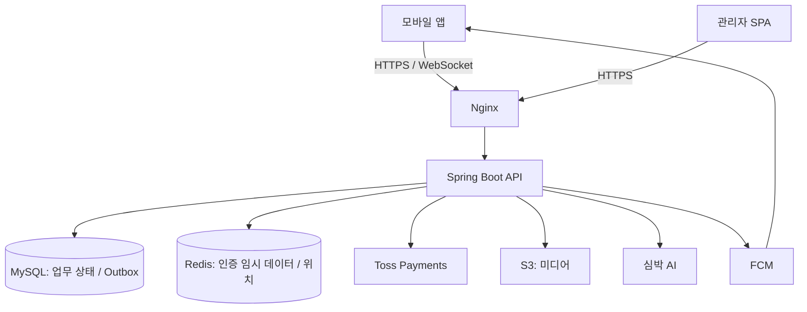

# WIDYU Architecture

WIDYU는 가족 관계를 기준으로 미디어·건강·위치 정보를 공유한다. 이 문서는 코드를 읽기 전에 알아야 할 현재 흐름, 정합성 경계, 장애 대응과 트레이드오프를 설명한다.

기준: 2026-09-14, `feature/604-integration` / `bc5dac28e8c3263a5f938c0975ffacf97e2fa2e2`. 이 통합 코드의 구현을 설명하며 실제 운영 배포 상태나 개별 PR의 포함 범위를 뜻하지 않는다. 운영값은 설정 기본값이며 실환경 확인과 구분한다.

## 전체 구조

`widyu-api`는 Controller·Service/Facade·Repository·외부 연동을, `widyu-domain`은 Entity·RedisHash·도메인 타입을 담는다. 모듈 의존 방향은 `widyu-api → widyu-domain`이다. Redis는 WebSocket 메시지 브로커가 아니며 STOMP 전달은 API 프로세스 안의 Simple Broker가 담당한다.

## 읽는 순서

| 영역 | 구조 문서 | 핵심 질문 |
| --- | --- | --- |
| 인증 | [Authentication](authentication.md) | 이전 토큰을 언제, 무엇을 근거로 거절하는가? |
| 실시간 | [WebSocket](websocket.md) | 구독과 실제 전달 시 가족 권한을 어떻게 확인하는가? |
| 알림 | [Notification](notification.md) | 업무 커밋과 FCM 호출을 어떻게 분리하고 복구하는가? |
| 결제 | [Payment](payment.md) | PG와 DB가 일시적으로 다를 때 어떻게 대조하는가? |
| 배포 | [Infrastructure](infrastructure.md) | 어디에 배포하며 장애·교체 시 무엇이 중단되는가? |

## 문서 역할과 갱신 규칙

| 문서 | 책임 | 변경 시점 |
| --- | --- | --- |
| Architecture | 기준 코드의 현재 구조·보장·한계 | 흐름, 경계, 보장 또는 운영 전제가 바뀔 때 |
| [ADR](../adr/README.md) | 문제, 실제 고려한 대안, 선택 이유와 결과 | 중요한 선택을 새로 하거나 기존 결정을 대체할 때 |
| [LLD](../lld/README.md) | API·테이블·상태 전이·예외·인수조건 | 구현 계약이 바뀔 때 |

Architecture에는 날짜별 변경 내역을 누적하지 않는다. 구조 변경 PR에서 해당 문서와 기준 커밋을 갱신하고 ADR·LLD를 연결한다. 이전 이유와 실패 이력은 해당 ADR·LLD·검증 기록에 남긴다. 결정이 바뀌면 과거 ADR에 대체 문서를 연결한다.

로컬의 `WIDYU_ARCHITECTURE_REVIEW_AND_REFACTORING_PLAN.md`와 `implementation-plans/`는 특정 시점의 리뷰·제안 기록이며 Git 제외 상태를 유지한다. 현재 구조의 진입점은 이 README다. 이번 문서 추가는 구현·정책 변경이 없어 신규 ADR·LLD는 N/A다.
