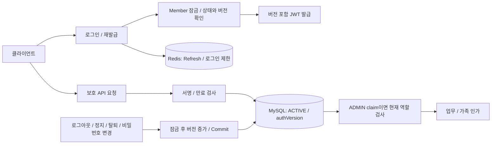

# Authentication Architecture

기준: 2026-09-14 / `bc5dac2` 통합 코드. [기준과 갱신 규칙](README.md).

## 1. Overview

JWT의 서명·만료에 더해 DB 회원의 ACTIVE 상태와 `authVersion`을 검증한다. Refresh 삭제만으로 폐기되지 않던 access token을 현재 DB 버전과 비교해 거절한다. 관리자 요청에는 현재 DB 역할 검사도 추가한다. SMS·로컬 로그인 요청 제한은 Redis가 담당한다.

## 2. Requirements

- 로그아웃·정지·탈퇴·비밀번호 변경 후 이전 버전의 세션을 거절한다.
- 과거 ADMIN claim만으로 현재 관리자 권한을 인정하지 않는다.
- 인증 코드 중복 소비와 반복 SMS·비밀번호 대입을 제한한다.

## 3. Architecture

## 4. Request Flow

1. 로컬 로그인은 계정·IP 제한을 예약하고 Member → LocalAccount 순서로 잠근 뒤 현재 비밀번호를 확인한다. 발급과 폐기는 같은 Member 잠금을 사용한다.
2. Refresh는 서명·만료, Redis 저장 토큰 일치 및 DB 상태·버전을 확인한다. 발급한 Refresh는 Redis TTL로 관리한다.
3. REST access는 DB의 현재 ACTIVE·버전을 확인한다. ADMIN claim이면 현재 ADMIN/ACTIVE를 추가 검사한다. USER claim을 DB 역할만으로 ADMIN으로 올리지 않는다.
4. 폐기는 버전 증가의 DB commit이 기준이다. 해당 회원의 모든 기기에 적용하며 Redis 삭제만을 근거로 삼지 않는다.
5. 회원가입용 임시 토큰은 별도 검증 경로를 사용한다. 기존 회원 계정 변경에 쓰는 임시 데이터는 회원 ID·버전을 확인한다.

## 5. Failure Handling

버전 누락·불일치·비활성 회원은 인증을 거절한다. DB 상태 검증 실패도 접근을 허용하지 않는다. SMS 제한 저장소 장애 또는 서비스 전체 발송 예산 누락은 503으로 발송을 차단하고, 한도 초과는 429와 Retry-After를 반환한다. 코드 소비 뒤 임시 토큰 발급이 실패하면 코드를 복원하지 않아 재발송이 필요하다.

## 6. Consistency Model

폐기는 MySQL 현재 상태에 근거한다. Redis 토큰 저장과 MySQL은 분산 트랜잭션이 아니므로 발급·저장 장애와 버전 검증을 함께 다뤄야 한다. 이미 인가를 마치고 실행 중인 REST 업무를 소급 취소하는 보장은 없다. 가족 인가는 인증과 별개이며 AOP 또는 명시적 서비스 경로로 검사한다.

## 7. Operational Parameters

| 항목 | 기본 정책 |
| --- | --- |
| SMS 번호 제한 | 60초 간격, 시간 3회, 24시간 10회 |
| SMS IP 제한 | 시간 30회 |
| SMS 전체 일일 한도 | 운영 입력 필수, 기본값 없음 |
| 인증 코드 오류 | 5회 이후 코드 TTL까지 차단 |
| 로컬·관리자 로그인 | 계정 15분 10회 / IP 15분 100회, 실패·진행 중 예약 공유 |

IP는 Tomcat에서 forwarding 전 peer를 보존하고 설정된 신뢰 프록시 체인만 해석한다. 실제 CIDR·공유 IP 영향은 운영에서 검증한다. 버전 없는 토큰 거절·배포 후 재로그인은 승인된 정책이며 구 서버와 혼합 운영하지 않는다. 과거 INACTIVE 분류와 DB migration은 LLD-0033을 따른다.

## 8. Trade-offs

폐기를 Redis eviction과 분리할 수 있지만 보호 요청에 DB 조회 비용·가용성 의존성이 생긴다. 계정 변경·발급 직렬화에는 동일 회원의 잠금 경합 비용도 있다. 요청 제한의 fail-closed 정책은 외부 비용 남용을 막는 대신 Redis 장애 시 정상 로그인·SMS도 거절할 수 있다.

## 9. Related Decisions

- [ADR-0002](../adr/ADR-0002-auth-jwt-family-access.md), [ADR-0020](../adr/ADR-0020-family-access-dual-path.md)
- [LLD-0031: 관리자](../lld/LLD-0031-admin-current-authority.md), [LLD-0033: 폐기](../lld/LLD-0033-session-revocation.md), [LLD-0034: 제한](../lld/LLD-0034-auth-request-limits.md)
- 코드 진입점: [JwtTokenProvider](../../backend/widyu-api/src/main/java/com/widyu/global/security/JwtTokenProvider.java), [MemberSessionService](../../backend/widyu-api/src/main/java/com/widyu/global/security/MemberSessionService.java)
