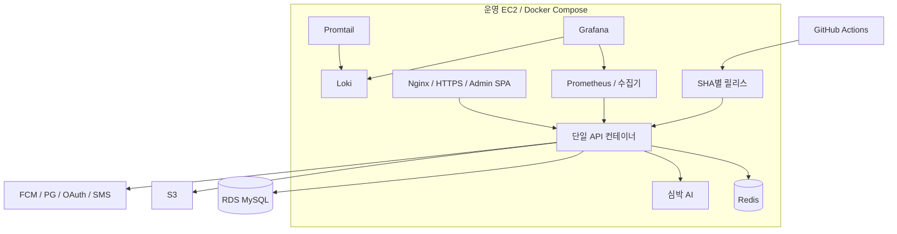

# Infrastructure Architecture

기준: 2026-09-14 / `bc5dac2` 통합 코드. [기준과 갱신 규칙](README.md). 아래는 저장소의 배포 구성·설계이며 실제 AWS 자원 상태를 확인한 문서가 아니다.

## 1. Overview

운영은 EC2의 API 단일 컨테이너를 교체하는 Docker Compose 배포로 시작한다. Nginx가 HTTPS와 관리자 SPA를 제공한다. 업무 데이터는 RDS MySQL, 미디어는 S3, 인증 임시 데이터·위치는 Redis에 저장한다. Redis·AI·관측 도구는 같은 서버에 배치하는 구성이다.

## 2. Requirements

- SHA별 이미지와 릴리스 파일로 배포·복원 대상을 식별한다.
- DB migration과 앱 교체를 분리하고 시작 시 스키마를 validate한다.
- 개발 서버 알림 설정이 로컬에 자동 적용되지 않게 한다.

## 3. Architecture

## 4. Request and Deployment Flow

요청은 Nginx → API로 들어온다. 도메인별 외부 호출·정합성 경계는 각 Architecture 문서를 따른다. 배포는 테스트·admin 빌드 후 SHA별 이미지로 API를 교체한다. 교체 중 요청 중단·WebSocket 재접속을 허용한다. production은 수동 workflow와 production Environment 정책을 사용한다.

| 환경 | Compose 적용 순서 | 주요 차이 |
| --- | --- | --- |
| 로컬 | `docker-compose.yml` → `docker-compose.dev.yml` | MySQL 컨테이너·개발 profile |
| 개발 서버 | 공통 → dev → `docker-compose.dev-server.yml` | Grafana 외부 HTTPS·Discord 알림 provisioning |
| 운영 | 공통 → `docker-compose.prod.yml` | RDS·schema validate·운영 자원 제한 |

dev-server는 Grafana 서버 설정을 추가한다. 로컬 `dev-up.sh`는 이를 사용하지 않아 로컬 ERROR 로그가 개발 서버 Discord 알림으로 전송되지 않는다.

## 5. Failure Handling

교체 실패 시 이전 릴리스 복원 절차를 따른다. 이미지 복원만으로 DB schema·외부 side effect를 되돌릴 수 없다. migration은 적용 순서·하위 호환을 따로 확인한다. API 장애 시 메모리 WebSocket 구독은 사라지고 DB의 결제 처리 상태·FCM Outbox는 재기동 후 복구 대상이다.

운영 Redis는 256MB / noeviction / AOF 설정이다. 메모리 부족 시 제한 키를 eviction하지 않는 대신 Refresh·위치 등 공유 쓰기도 실패할 수 있다. AOF만으로 무손실 복구·고가용성을 보장하지 않는다.

## 6. Consistency and Availability

단일 API 교체는 구·신 scheduler 중복과 메모리 사용을 줄이지만 무중단 배포·EC2 자동 failover를 제공하지 않는다. FCM 행 선점이 다중 worker에 안전하더라도 WebSocket broker·업무 scheduler를 포함한 전체 서비스를 그대로 수평 확장할 수 있다는 뜻은 아니다.

## 7. Operational Parameters

prod API는 메모리 제한 1536MB, JVM 최대 heap 768MB, 종료 유예 45초다. 실제 부하·호스트 여유 메모리 적합성은 별도 측정한다. 관측 도구 포트는 loopback에 제한한다. 지표는 Prometheus, 로그는 Loki, 조회·경보는 Grafana가 담당한다. 실제 경보 수신·복구 시간은 운영 기록을 확인해야 한다.

## 8. Trade-offs

기존 Compose·관측 스택을 재사용하지만 API·Redis·AI·관측 도구가 호스트 자원을 공유한다. 백업 존재와 복원 성공은 다르며 RDS/S3 복원, 구 앱 호환, 재로그인 안내와 안전한 rollback은 [운영 복구 검증](../operations/production-recovery-verification.md)의 후속 확인 사항이다.

## 9. Related Decisions

- [ADR-0023: 배포](../adr/ADR-0023-production-single-container-deployment.md), [ADR-0024: 개발 관측](../adr/ADR-0024-development-observability-stack.md)
- [개발 관측 운영 가이드](../operations/development-observability.md), [LLD-0027](../lld/LLD-0027-development-error-observability.md)
- 구성 진입점: [공통 Compose](../../docker-compose.yml), [운영 Compose](../../docker-compose.prod.yml), [개발 서버 Compose](../../docker-compose.dev-server.yml)
