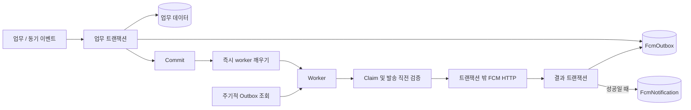

# Notification Architecture

기준: 2026-09-14 / `bc5dac2` 통합 코드. [기준과 갱신 규칙](README.md).

## 1. Overview

업무 트랜잭션은 고정 수신자와 기기별 발송 요청을 MySQL Outbox에 저장한다. 커밋 후 worker가 FCM을 호출하고 실패 작업을 영속 재시도한다. 업무 도중 외부 HTTP를 기다리던 구조에서 업무·발송 요청의 원자적 저장과 별도 송신으로 경계를 옮겼다. 선택 이유와 대안은 [ADR-0028](../adr/ADR-0028-fcm-durable-delivery.md)에 있다.

## 2. Requirements

- 업무 rollback이면 해당 Outbox와 발송도 남지 않는다.
- FCM 지연 동안 업무 DB 트랜잭션과 잠금을 유지하지 않는다.
- 중단된 작업을 회수하되 수신자·가족 자격, 시도 횟수, 만료를 다시 확인한다.
- 고정 수신자 외의 계정이 알림 이력을 읽지 못하게 한다.

## 3. Architecture

## 4. Request Flow

1. 업무 또는 스케줄러가 기기별 고정 수신자·토큰 ID·내용·관련 가족·만료 시각을 저장한다. 활성 토큰이 없으면 Outbox도 생성하지 않는다.
2. 커밋 후 최초 실행을 제출한다. 실행기 포화나 서버 종료로 제출을 놓쳐도 polling으로 회수한다.
3. 짧은 claim 트랜잭션에서 행을 잠그고 lease(점유 기한)·fence(점유 세대)·횟수를 갱신한다.
4. OAuth 자격증명 준비 뒤 별도 preflight 트랜잭션으로 회원 상태·토큰 소유자·알림 설정·필요한 가족 관계와 만료를 재검증한다.
5. DB 트랜잭션 밖에서 HTTP를 호출한다. 결과 트랜잭션은 fence와 lease를 확인해 성공 상태와 알림 이력을 함께 저장하거나 재시도를 예약한다.

`FcmNotification`은 FCM 성공을 DB에 반영할 때 생성하는 기기별 이력이다. 실패·만료 건은 이력에 나타나지 않을 수 있다. 관리자 테스트 발송은 Outbox를 통하지 않는 제한시간 있는 동기 호출이며 HTTP 성공 토큰 수를 반환한다.

## 5. Failure Handling

| 상황 | 처리 |
| --- | --- |
| timeout / 429 / 5xx | 제한 내 재시도. Retry-After가 자체 지연보다 길면 반영 |
| 토큰 영구 무효 | 발송 당시 토큰과 현재 소유자가 일치하는 경우만 비활성화하고 종료 |
| 회원 정지 / 토큰 이전 / 설정 OFF / 가족 해제 | 발송 전 검증에서 CANCELLED |
| 만료 / 시도 소진 | EXPIRED / EXHAUSTED |
| claim 뒤 서버 종료 | lease 만료 후 재선점. 이전 fence의 결과 반영 거절 |
| FCM 수락 뒤 finalize 전 종료 | 재시도에서 중복 Push 가능 |

## 6. Consistency Model

업무 데이터와 Outbox는 같은 트랜잭션이며, SENT와 신규 이력은 별도의 결과 트랜잭션이다. FCM 호출 자체는 DB와 원자적으로 commit할 수 없다.

전달 방식은 중복 가능한 영속 재시도(at-least-once 방식)다. 유효기간·횟수 제한 및 취소가 있으므로 단말에 최소 한 번 도착하는 보장은 없다. HTTP 성공도 단말 수신·화면 표시를 뜻하지 않는다. `data.notificationId`는 재시도에 유지되는 Outbox ID이며 알림 이력 ID와 다르다. 앱 중복 제거는 LLD 기준 미구현이다.

발송 직전 검증과 실제 HTTP 사이의 권한 변경 경쟁은 남는다. 원수신자 불명 legacy 이력은 원본을 보존하되 앱 목록·개수·읽음 처리에서 숨긴다.

## 7. Operational Parameters

| 설정 | 기준 코드의 값 |
| --- | --- |
| 최초 시도 | 커밋 후 즉시 제출, 큐 대기 가능 |
| 추가 재시도 | prod 기본 최대 5회, 최초 포함 최대 6회 선점 시도 |
| 일반 / 긴급 TTL | prod 기본 24시간 / 5분 |
| lease / HTTP 전체 대기 | 기본 60초 / 10초 |
| polling / 조회 batch | 기본 1초 / 최대 50건 |
| worker / 대기열 | 2개 / 100개 |

TTL은 enqueue 시 저장한 만료 시각을 유지한다. Android TTL과 APNs 절대 만료도 전달한다. prod 기본값은 환경변수로 재정의할 수 있으며 local/dev는 별도 정책값 주입을 확인해야 한다. SQL은 앱 배포 전에 적용한다. `fcm.send` timer는 기기별 처리 시간을 측정하며 큐 대기·단말 전달 시간은 제외한다. backlog 경보·종료 행 보존/정리는 별도 운영 확인 대상이다.

## 8. Trade-offs

영속 저장으로 커밋 후 작업 유실 구간을 줄이고 외부 FCM 장애를 업무 트랜잭션에서 분리한다. Outbox 저장 자체의 DB 실패는 업무 rollback을 일으킬 수 있다. 테이블·worker·자격 조회 비용이 생기며 동일 업무 이벤트를 두 번 enqueue하는 것까지 claim/fence가 중복 제거하지는 않는다. 한 행의 경쟁 제어가 전체 시스템의 다중 인스턴스 운영을 보장하지도 않는다.

## 9. Related Decisions

- [ADR-0028](../adr/ADR-0028-fcm-durable-delivery.md), [LLD-0036](../lld/LLD-0036-fcm-durable-delivery.md), [토큰 소유권 LLD](../lld/LLD-0014-fcm-token-ownership-transfer.md)
- 코드 진입점: [Outbox 저장](../../backend/widyu-api/src/main/java/com/widyu/fcm/application/FcmOutboxService.java), [claim / preflight / finish](../../backend/widyu-api/src/main/java/com/widyu/fcm/application/FcmOutboxTransactions.java)
