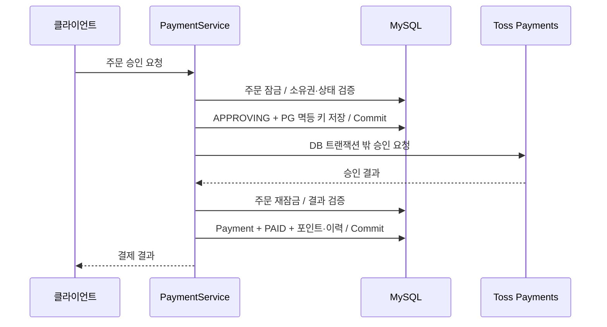

# Payment Architecture

기준: 2026-09-14 / `bc5dac2` 통합 코드. [기준과 갱신 규칙](README.md).

## 1. Overview

시니어가 서버에 생성한 포인트 주문을 Toss Payments로 승인한다. DB 선점 → PG 호출 → DB 결과 반영으로 나누어 외부 지연 중 DB 잠금을 보유하지 않는다. PG와 DB 불일치는 저장된 처리 상태·PG 멱등 키로 대조하고 복구한다.

## 2. Requirements

- 서버가 주문 금액·포인트와 소유자를 결정·검증한다.
- 같은 주문의 승인·결제 저장·적립을 중복 반영하지 않는다.
- 응답 유실이나 DB rollback 뒤 PG 결과를 대조할 근거를 보존한다.
- 취소 중 환수할 포인트가 사용되어 없어지지 않게 예약한다.

## 3. Architecture

## 4. Request Flow

1. 서버 패키지의 금액·포인트로 주문을 생성한다. 승인 요청의 주문과 현재 회원을 대조한다.
2. 주문 행 잠금으로 승인을 선점하고 PG 키를 저장한다. 동일 진행 중 요청은 같은 PG 키를 재사용한다. 완료 요청은 기존 결과를 반환한다.
3. PG를 호출하고 결과 트랜잭션에서 상태·금액·주문·결제 키를 확인한 뒤 결제와 포인트를 함께 반영한다.
4. 부분 취소는 클라이언트 멱등 키와 요청 내용의 일치를 검사한다. Payment 잠금 아래 PENDING 취소와 서버 PG 키를 저장하고 선점 시 포인트를 차감해 예약한다.
5. 취소 확정은 상태·누적 취소액을 반영하며 포인트를 다시 차감하지 않는다. 취소 포기 경로는 예약을 반환하고 불일치 수동 대사 경로는 예약을 유지한다.

## 5. Failure Handling

| 상황 | 처리 |
| --- | --- |
| PG 성공 뒤 응답 유실 / 결과 DB rollback | 처리중 상태와 오류·다음 재시도 시각 보존 |
| 복구 시 PG 완료 확인 | 별도 결과 트랜잭션으로 멱등 반영 |
| PG 미완료 | 상태·오류 코드·기한을 보고 같은 PG 키로 재요청 또는 선점 해제 |
| 승인 자동 POST 기한 경과 | 처리중 상태를 보존하고 수동 대사 요구 |
| PG 누적 취소액이 예상보다 큼 | 예약 포인트 유지, 자동 복구 중단·수동 대사 |

PG 조회가 계속 실패하면 재시도를 예약하는 경로가 있다. 모든 오류가 고정 횟수 후 종료되는 구조는 아니다. 처리중 backlog와 중단 상태를 추적해야 한다.

## 6. Consistency Model

PG와 MySQL은 분산 트랜잭션이 아니다. 행 잠금·DB 고유 제약·PG 멱등 키로 반복 요청을 제어하며 외부 상태는 복구 또는 수동 대사로 맞춘다. 무조건적인 자동 수렴이나 외부 결제 exactly-once를 선언하지 않는다.

DB 방어선은 주문 `order_id`, 결제 `payment_key`와 `payment_order_id`, 취소 `(payment_id, idempotency_key)`, 포인트 이력 `operation_key`의 고유 제약이다. 실제 배포 DB에 해당 제약이 존재해야 한다. 서로 다른 주문 생성까지 같은 업무 요청으로 판단하지 않는다.

## 7. Operational Parameters

| 항목 | 기준 코드의 값 |
| --- | --- |
| 주문 만료 | 생성 후 15분 |
| 복구 scheduler | fixed delay 60초 |
| 최초 복구 예약 | 선점 후 2분 |
| 실패 후 backoff | 30초부터 지수 증가, 최대 900초 |
| 승인 자동 POST / 취소 멱등 기간 판단 | 코드 기준 10분 / 15일 |

기간은 서버 코드의 판단 기준이며 실제 PG 계약 검증 결과를 대신하지 않는다. API 재요청과 scheduler가 같은 작업을 호출할 수 있으므로 HTTP 횟수가 한 번이라고 기대하면 안 된다.

## 8. Trade-offs

PG 지연 중 DB 연결·잠금 점유를 줄이는 대신 중간 상태·오류 분류·복구·운영 대사 비용이 생긴다. 포인트 예약은 취소 중 잔액 사용을 제한한다. 운영 구성은 단일 API 전제이며 다중 scheduler까지 검증 완료한 구조는 아니다.

H2/mock은 MySQL 잠금과 실제 commit 검증을 대체하지 않는다. [MySQL 검증 LLD](../lld/LLD-0035-payment-failure-measurement.md)의 환경·시나리오·미검증 범위를 따른다. 문서 작성 중 실제 PG·운영 DB·프로세스 종료 시험은 실행하지 않았다.

## 9. Related Decisions

- [ADR-0012: 취소·예약](../adr/ADR-0012-payment-cancel-idempotency.md), [ADR-0016: PG 경계](../adr/ADR-0016-payment-pg-call-transaction-separation.md)
- [LLD-0016: 승인](../lld/LLD-0016-payment-confirmation-idempotency.md), [LLD-0017: 취소](../lld/LLD-0017-payment-partial-cancel-idempotency.md), [LLD-0022: 복구](../lld/LLD-0022-payment-pg-call-transaction-separation.md)
- 코드 진입점: [PaymentService](../../backend/widyu-api/src/main/java/com/widyu/pay/application/PaymentService.java), [PaymentTransactionService](../../backend/widyu-api/src/main/java/com/widyu/pay/application/PaymentTransactionService.java)
