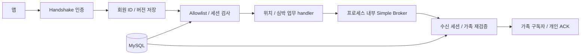

# WebSocket Architecture

기준: 2026-09-14 / `bc5dac2` 통합 코드. [기준과 갱신 규칙](README.md).

## 1. Overview

`/ws/location`의 SockJS/STOMP 연결로 위치·심박을 송수신한다. 정확한 목적지 allowlist와 가족 인가를 적용하고 연결 이후에도 DB 상태·세션 버전·가족 권한을 확인한다. 이는 최초 구독만 검사하면 가족 해제 뒤에도 수신할 수 있는 문제를 다룬다.

## 2. Requirements

- 타 가족 토픽·임의 wildcard·raw broker 큐 구독 및 broker 직접 SEND를 차단한다.
- 메시지 큐 대기 중 권한이 바뀌어도 handler 실행 직전에 검사한다.
- 정상 발신과 가족 구독, 개인 ACK 경로를 유지한다.

## 3. Architecture

## 4. Request Flow

1. Authorization JWT 또는 30초 일회용 WS 토큰으로 handshake를 인증하고 서버 세션에 회원 ID·버전을 저장한다.
2. SUBSCRIBE/SEND는 아래 정확한 목적지만 허용한다. 가족 토픽은 대상 시니어와 보호자의 현재 가족 관계를 검사한다.
3. 위치 발신자 ID는 인증 회원과 대조한다. 심박은 인증 회원 ID로 단건 처리한다.
4. 서버가 broker로 전달한다. `WsSessionGuard`는 inbound/outbound handler 실행 직전에 상태·버전 및 가족 토픽 권한을 검사한다.

| 명령 | 목적지 |
| --- | --- |
| SEND | `/app/location/update`, `/app/heart-rate/send-single` |
| SUBSCRIBE: 가족 | `/topic/location/senior/{memberId}`, `/topic/heart-rate/{memberId}` |
| SUBSCRIBE: 개인 | `/user/queue/location/ack`, `/user/queue/heart-rate/result`, `/user/queue/errors` |

## 5. Failure Handling

미등록 목적지는 폐기한다. 상태·버전·가족 검증 실패나 DB 오류 시 전달을 차단하고 연결을 닫는다. 폐기 commit 이벤트는 로컬 연결을 종료하며 1초 주기 상태·버전 검사로 다른 인스턴스의 유휴 폐기 연결도 확인한다. 가족 해제는 가족 토픽 전달 시 재검증해 차단한다. 서버 교체 후 앱은 재인증·재연결·재구독해야 한다.

## 6. Consistency Model

인가 결과를 연결 수명 동안 캐시하지 않는다. 검사 직후부터 전송 사이의 변경이나 이미 전달한 메시지를 회수하는 보장은 없다. Simple Broker는 메모리 기반이며 재접속 후 누락 메시지 replay나 DB와의 원자적 발송을 제공하지 않는다. 심박 결과 ACK는 발신 세션을 지정한다.

## 7. Operational Parameters

WS 토큰은 Redis에서 원자 소비하며 TTL은 30초다. 연결·broker 상태는 API 프로세스에 속한다. 배포 구성은 API 단일 인스턴스이며 Redis 위치 저장이 인스턴스 간 STOMP 메시지를 중계하지 않는다.

## 8. Trade-offs

전달 시점 인가는 권한 변경 뒤 노출을 줄이지만 메시지 처리·유휴 연결 검사에 DB 조회 비용이 든다. 새 실시간 경로는 allowlist와 테스트를 함께 갱신해야 한다. 다중 API 확장에는 broker 전달 구조와 연결 라우팅 설계가 필요하다.

## 9. Related Decisions

- [ADR-0002](../adr/ADR-0002-auth-jwt-family-access.md), [ADR-0020](../adr/ADR-0020-family-access-dual-path.md)
- [LLD-0032: 목적지](../lld/LLD-0032-websocket-destination-allowlist.md), [LLD-0033: 세션](../lld/LLD-0033-session-revocation.md), [LLD-0023: 심박 ACK](../lld/LLD-0023-heart-rate-single-measurement-transport.md)
- 코드 진입점: [WebSocketConfig](../../backend/widyu-api/src/main/java/com/widyu/global/config/WebSocketConfig.java), [WsSessionGuard](../../backend/widyu-api/src/main/java/com/widyu/global/websocket/WsSessionGuard.java)
