# ERD-0001: 초기 도메인 ERD

| 항목 | 값 |
| --- | --- |
| 상태 | Accepted |
| 날짜 | 2026-07-05 |
| 코드 동기화 | 2026-09-16 (study 도메인 추가) |
| 관련 | ADR-0001 |

## 목적

현재 코드의 JPA 엔티티를 기준으로 도메인 데이터 모델을 기록한다.
이 문서는 **실제 테이블·컬럼·enum·인덱스의 기준 문서**다.
엔티티 변경 시 코드와 함께 이 문서를 수정한다.

## 현재 모델링 규칙

- 공통 시간 필드는 `BaseTimeEntity`가 제공한다 (`created_at`, `updated_at`).
- PK는 각 엔티티가 `Long id` + `GenerationType.IDENTITY`로 선언한다.
- `Status` 값: `ACTIVE`, `INACTIVE`, `DELETED`, `PROCESSING`.
- soft delete는 전역 규칙이 아니다. `@SQLDelete`, `@Where` 적용 여부를 엔티티별로 기록한다.
- JPA 연관관계(`@ManyToOne`, `@OneToMany`, `@JoinColumn`)를 사용한다.
- enum은 `@Enumerated(EnumType.STRING)` 기준으로 문자열 저장한다.
- 엔티티는 `widyu-domain` 모듈에만 위치한다.
- Redis 엔티티(`@RedisHash`)는 MySQL 테이블이 아니다. 별도 섹션에 정리한다.

## Mermaid ERD

```mermaid
erDiagram
    Member {
        Long id PK
        String name
        String phoneNumber
        String profileImage
        MemberRole role
        MemberType type
        Status status
        Long medicationAlarmRevision
    }

    LocalAccount {
        Long id PK
        Long member_id FK
        String email
        String password
        Boolean isFirst
    }

    SocialAccount {
        Long id PK
        Long member_id FK
        String provider
        String oauthId
        String email
        String refreshToken
        Boolean isFirst
    }

    Family {
        Long id PK
        String familyCode
    }

    FamilyMembership {
        Long id PK
        Long family_id FK
        Long guardian_id FK
        String nickname
        Boolean isRepresentative
        Boolean isLeader
        LocalDateTime connectedAt
    }

    SeniorProfile {
        Long id PK
        Long member_id FK
        Long family_id FK "nullable: 마지막 방장 탈퇴 시 Family 삭제 후 null 처리"
        String address
        String inviteCode
        LocalDate birthDate
        Long points
        Long version
        Integer defaultWalkGoal
    }

    PointHistory {
        Long id PK
        Long senior_profile_id FK
        PointHistoryType type
        Long amount
        String description
    }

    Album {
        Long id PK
        Long member_id FK
        String content
        Integer likeCount
        Integer commentCount
        Integer viewCount
        Status status
    }

    AlbumComment {
        Long id PK
        Long album_id FK
        Long member_id FK
        Long parent_comment_id FK
        String content
        Integer likeCount
        Integer depth
        Status status
    }

    AlbumLike {
        Long id PK
        Long album_id FK
        Long member_id FK
    }

    AlbumUnlock {
        Long id PK
        Long album_id FK
        Long member_id FK
        LocalDateTime unlockedAt
    }

    HealthSchedule {
        Long id PK
        Long member_id FK
        String scheduleName
        String placeAddress
        Double latitude
        Double longitude
        LocalDateTime scheduledAt
        ProgressStatus progressStatus
        Integer rewardPoint
        Boolean isReward
        Status status
    }

    Medicine {
        Long id PK
        String itemSeq
        String itemName
        String entpName
        String itemImage
        String efcyQesitm
        String useMethodQesitm
    }

    MedicineSchedule {
        Long id PK
        Long member_id FK
        LocalTime alarmTime
        Status status
        LocalDate effectiveFrom
        LocalDate effectiveTo
    }

    MedicineCategory {
        Long id PK
        Long medicine_schedule_id FK
    }

    MedicineScheduleDetail {
        Long id PK
        Long medicine_category_id FK
        Long medicine_id FK
        Integer dose
    }

    MedicationProof {
        Long id PK
        Long medicine_schedule_id FK
        Long member_id FK
        LocalDateTime verifiedAt
    }

    Walk {
        Long id PK
        Long member_id FK
        LocalDate walkDate
        Integer goalSteps
        Integer actualSteps
    }

    HeartRateEmergency {
        Long id PK
        Long member_id FK
        Integer heartRate
        LocalDateTime measuredAt
        String location
    }

    HeartRateEvent {
        Long id PK
        Long member_id FK
        Integer heartRate
        LocalDateTime measuredAt "Asia/Seoul 환산, UK (member_id, measured_at)"
        HeartRateStatus status
        String accuracy "워치 보고 정확도 (단건 경로는 null)"
        String batchId "배치 원문 참조 (단건 경로는 null)"
    }

    SensorBatch {
        Long id PK
        String batchId UK "앱이 붙인 불변 멱등 키 (ULID)"
        Long member_id FK
        String stream "imu_watch / imu_phone / hr"
        String source "watch / phone"
        String deviceId
        String sessionId
        Long seq
        String studyId "서버가 검증한 회차 값, null 허용"
        String participationId "서버가 검증한 회차 값, null 허용"
        String runId "회원·기기·측정 시각 검증을 통과한 회차, null 허용"
        String bootId "시계 환산 원본 ①"
        String clockMappingId "② clock_mapping의 FK 없는 참조"
        Long anchorElapsedNs "③ 문자열→long 무손실"
        Long anchorEpochMs "④"
        Double uncertaintyMs "⑤"
        Integer accN "없으면 null"
        Integer gyroN "없으면 null (0 치환 금지)"
        Integer sampleCount "심박 배치 샘플 수 (IMU는 null)"
        Long accT0ElapsedNs
        Long gyroT0ElapsedNs
        Double accFsHzRequested
        Double gyroFsHzRequested
        Long measuredAtStartMs "서버 환산"
        Long measuredAtEndMs "서버 환산"
        Long phoneReceivedAtMs
        Long serverReceivedAtMs
        Long acceptedAtMs
        Long persistedAtMs
        Long modelAvailableAtServerMs "소급 금지"
        String collectionMode "product / research (심박은 null)"
        String gyroMode "continuous / trigger (심박은 null)"
        Boolean onBody
        String wearState
        String missingReason
        Integer watchBatteryPct
        String qualityStatus "이번 PR은 OK 고정"
        String triggerKind
        Double triggerSmvG
        Long triggerEventElapsedNs
        Long triggerTsMs
        Boolean gyroBackfill
        String backfillFor "배열이면 쉼표 결합"
        Boolean isResend
        String originalBatchId
        Long originalSeq
        String originalRunId
        String originalSessionId
        Long resentAtMs
        String s3Key
        Integer byteSize
        String payloadSha256 "원문 바이트 해시"
        Boolean configMismatch "앱 적용 설정이 서버 지시값과 다름 (B12)"
    }

    DeviceHeartbeat {
        Long id PK
        Long member_id FK
        String deviceId
        String sessionId
        Long tsMs "(device, session, ts_ms) UK"
        String runId
        Integer phoneBatteryPct
        Boolean socketConnected
        Boolean watchConnected
        Boolean watchOnBody
        Long lastImuTsMs
        Long serverReceivedAtMs
        Long acceptedAtMs
        Long persistedAtMs
    }

    LocationFix {
        Long id PK
        Long member_id FK "위치 기준 기기는 폰 (B 1.6.5)"
        String deviceId
        String sessionId
        Long seq "(device, session, seq) UK 로 멱등"
        String studyId "받은 값 그대로, null 허용"
        String participationId "받은 값 그대로, null 허용"
        String runId "회차 귀속 (B8 재사용)"
        Long tsMs "잰 시각"
        Double lat
        Double lon
        Double accuracyM "100m 초과도 저장 (정책 1.6.6)"
        Double speedMps
        Double speedAccuracyMps
        Double headingDeg
        Double altitudeM
        String provider "fused / gps 등"
        Boolean isMock "값 그대로 저장"
        String reason "move / keepalive / incident"
        Long serverReceivedAtMs
        Long acceptedAtMs
        Long persistedAtMs
        String payload "원문 바이트 그대로 (TEXT)"
        String payloadSha256
    }

    CollectionRun {
        Long id PK
        String runId UK "서버 발급 run-<UUID hex>"
        Long member_id FK "대상 참가자"
        String studyId
        String participationId
        String protocolRef "사람이 읽는 회차 번호"
        String consentVersion "서면 연구 동의 판"
        String collectionMode "product / research"
        Long startedAtMs
        Long endedAtMs
        CollectionRunStatus status "OPEN / CLOSED"
        Integer openMarker "OPEN=1, UK(member_id, open_marker)"
        String dataPolicy "RETAIN 등 (값 집합 미정)"
        LocalDate identifiedUntil
        LocalDate pseudonymizedAt
        LocalDate researchUntil
        String qualityNotes
        String missingReason
        String acceptanceReceiptId "K3, 아직 미사용"
    }

    RunDeviceAssignment {
        Long id PK
        String assignmentId UK "asg-<UUID hex>"
        Long run_id FK
        String deviceId
        String role "watch / phone / external_ecg / operator_marker"
        String wearSite "값 집합 S1 미정"
        Long assignedAtMs
        Long unassignedAtMs "null이면 배정 중"
        Integer activeMarker "배정 중=1, UK(device_id, active_marker)"
    }

    RunExport {
        Long id PK
        String exportId UK "exp-<UUID hex>"
        String runId "문자열 참조 (FK 없음)"
        RunExportStatus status "QUEUED / RUNNING / DONE / FAILED"
        Long requestedAtMs
        Long startedAtMs
        Long finishedAtMs
        String s3Key "exports/{runId}/{exportId}/run_{runId}.zip"
        Long bytes
        String sha256
        String errorType "예외 클래스명만"
        String serverBuild
    }

    DecisionRecord {
        Long id PK
        String decisionId UK
        Long memberId
        String runId
        String decisionOutput "ALERT / NO_ALERT / ABSTAIN_INSUFFICIENT_INPUT"
        Long decisionAtMs
        Long inputCutoffMs
        Long featureSupportEndMs
        Long modelAvailableAtServerMaxMs
        Boolean alertDelivered
        String triggerBatchId
        Integer hrBpm "심박 행만. 판정 대상 샘플의 bpm"
        Long hrMeasuredAtMs "심박 행만. 샘플 잰 시각"
        String hrAccuracy "심박 행만"
        String reason "판정 사유 원문. 로그·응답 DTO 금지 (ADR-0035)"
    }

    RunMarker {
        Long id PK
        String markerId UK "앱 발급, 멱등"
        Long run_id FK
        String kind "값 목록은 연구 프로토콜"
        String label "정답 라벨"
        Long sourceElapsedNs
        Long tsMs
        String source "OPERATOR_APP / PARTICIPANT / AUTO"
        String sourceDeviceId
        String clockMappingId "누른 기기의 시계 매핑"
    }

    ClockMapping {
        Long id PK
        String clockMappingId UK "앱이 발급한 묶음 식별자"
        String deviceId "매핑은 기기 단위 (member 없음)"
        String bootId
        Long anchorElapsedNs
        Long anchorEpochMs
        Double uncertaintyMs
        Long observedMinElapsedNs "이 매핑을 쓴 배치의 축 시각 최소"
        Long observedMaxElapsedNs "최대"
        Long firstSeenAtMs
        Long lastSeenAtMs
    }

    PaymentOrder {
        Long id PK
        Long member_id FK
        String orderId
        String orderName
        String packageId
        Integer amount
        Integer pointAmount "항상 0, 폐기 예정 (ADR-0029)"
        PaymentOrderStatus status
        ZonedDateTime expiresAt
        String approvalPaymentKey
        String approvalPgIdempotencyKey
        ZonedDateTime approvalRequestedAt
        Integer approvalRetryCount
        ZonedDateTime approvalNextRetryAt
        String approvalLastErrorCode
        ZonedDateTime approvalRecoveryStoppedAt
    }

    Payment {
        Long id PK
        Long member_id FK
        Long payment_order_id FK
        String paymentKey
        String orderId
        Integer amount
        Integer canceledAmount
        PaymentStatus status
        ZonedDateTime approvedAt
    }

    PaymentCancel {
        Long id PK
        Long payment_id FK
        PaymentCancelStatus status
        String idempotencyKey
        Integer requestedCancelAmount
        String pgIdempotencyKey UK
        ZonedDateTime canceledAt
        Integer retryCount
        ZonedDateTime nextRetryAt
        String lastErrorCode
        ZonedDateTime recoveryStoppedAt
    }

    MemberFcmToken {
        Long id PK
        Long member_id FK
        String token
    }

    FcmNotification {
        Long id PK
        Long member_fcm_token_id FK
        Long recipient_member_id FK "nullable legacy only; fixed for new notifications"
        String title
        String body
        String image
        Boolean isRead
        FcmCategory fcmCategory
        String decisionId "nullable. 이 알림을 낳은 판정 (LLD-0053)"
    }

    FcmOutbox {
        Long id PK
        Long recipient_member_id FK
        Long member_fcm_token_id FK
        Long related_member_id "nullable relationship subject"
        Long family_id "nullable family snapshot"
        String title
        String body
        String image
        String scheme
        String dataType
        Long dataRevision
        FcmCategory fcmCategory
        Boolean emergency
        String state
        Integer attempts
        Long fence
        LocalDateTime availableAt
        LocalDateTime expiresAt
        LocalDateTime leaseUntil
        String decisionId "nullable. 이 알림을 낳은 판정 (LLD-0053)"
    }

    ConsentRecord {
        Long consent_record_id PK
        Long member_id FK
        ConsentKey consentKey "인앱 동의 항목 6종"
        String version "앱이 보여 준 동의문 판. 철회 행은 직전 판 복사"
        boolean granted "false = 철회 또는 미동의"
        LocalDateTime recordedAt "서버 시각. 행이 불변이라 updated_at 없음"
        ConsentSource source "APP / ADMIN (지금은 APP만)"
    }

    MemberNotificationSetting {
        Long id PK
        Long member_id FK
    }

    AddressBookmark {
        Long id PK
        Long member_id FK
        String roadAddress
        String address
        String name
        Double latitude
        Double longitude
        Status status
    }

    StudyParticipation {
        Long id PK
        String studyId
        String participationId UK
        Long member_id FK
        DataPolicy dataPolicy
        LocalDate identifiedUntil
        LocalDate pseudonymizedAt
        LocalDate researchUntil
        String consentVersion
        StudyParticipationStatus status
    }

    AdminAuditLog {
        Long id PK
        Long member_id FK
    }

    AdminAccessLog {
        Long admin_access_log_id PK
        Long admin_id
        String admin_name
        String method
        String path
        String query
        Long target_member_id
        String target_ref
        int status
        String client_ip
        String user_agent
        LocalDateTime accessed_at
    }

    MedicationProofImageDeletionTask {
        Long id PK
        Long member_id FK
        String object_key
        MedicationProofImageDeletionTaskStatus status
        int retry_count
        int processing_attempt
        LocalDateTime lease_expires_at
        LocalDateTime next_retry_at
        String last_error_type
    }

    Member ||--o{ LocalAccount : "1:1"
    Member ||--o{ SocialAccount : "1:N"
    Member ||--o{ FamilyMembership : "보호자"
    Member ||--o| SeniorProfile : "시니어"
    Member ||--o{ Album : "업로드"
    Member ||--o{ AlbumComment : "작성"
    Member ||--o{ AlbumLike : "좋아요"
    Member ||--o{ AlbumUnlock : "포인트 해금"
    Member ||--o{ HealthSchedule : "건강 일정"
    Member ||--o{ MedicineSchedule : "복약 알림"
    Member ||--o{ MedicationProof : "복약 인증"
    Member ||--o{ Walk : "걸음 기록"
    Member ||--o{ HeartRateEmergency : "심박 이상"
    Member ||--o{ HeartRateEvent : "심박 측정 이력"
    Member ||--o{ SensorBatch : "원시 센서 배치 (S3 인덱스)"
    SensorBatch }o--|| ClockMapping : "clock_mapping_id 참조 (FK 없음)"
    Member ||--o{ LocationFix : "위치 원본 (잰 시각·정확도·속도·사유)"
    Member ||--o{ DeviceHeartbeat : "기기 상태 하트비트 (60초)"
    Member ||--o{ CollectionRun : "측정회차 (대상 참가자)"
    CollectionRun ||--o{ RunDeviceAssignment : "기기 배정"
    CollectionRun ||--o{ RunMarker : "마커 (정답 라벨)"
    CollectionRun ||..o{ RunExport : "내보내기 잡 (run_id 문자열 참조)"
    Member ||--o{ PaymentOrder : "결제 주문"
    Member ||--o{ Payment : "결제"
    Member ||--o{ MemberFcmToken : "FCM 토큰"
    Member ||--o{ MemberNotificationSetting : "알림 설정"
    Member ||--o{ ConsentRecord : "인앱 동의 기록 (추가 전용)"
    Member ||--o{ AddressBookmark : "주소 즐겨찾기"
    Member ||--o{ AdminAuditLog : "관리자 로그"
    Member ||..o{ AdminAccessLog : "관리자 접속기록 (admin_id·target_member_id, FK 없음)"
    Member ||--o{ StudyParticipation : "실증 참여 (재식별 키)"
    Member ||--o{ MedicationProofImageDeletionTask : "복약 사진 삭제 작업"

    Family ||--o{ FamilyMembership : "보호자 구성"
    Family |o--o{ SeniorProfile : "시니어 구성"

    SeniorProfile ||--o{ PointHistory : "포인트 내역"

    Album ||--o{ AlbumComment : "댓글"
    Album ||--o{ AlbumLike : "좋아요"
    Album ||--o{ AlbumUnlock : "잠금 해제"
    AlbumComment ||--o{ AlbumComment : "대댓글"

    MedicineSchedule ||--o{ MedicineCategory : "카테고리"
    MedicineSchedule ||--o{ MedicationProof : "복약 인증"
    MedicineCategory ||--o{ MedicineScheduleDetail : "약 상세"
    MedicineScheduleDetail }o--|| Medicine : "약 참조"

    Payment ||--o{ PaymentCancel : "취소"
    Payment ||--|| PaymentOrder : "주문 참조"

    MemberFcmToken ||--o{ FcmNotification : "알림 수신"
    Member |o--o{ FcmNotification : "고정 수신자 (기존 이력 nullable)"
    Member ||--o{ FcmOutbox : "고정 발송 수신자"
    MemberFcmToken ||--o{ FcmOutbox : "발송 대상 기기"
```

## Redis 엔티티 (MySQL 테이블 아님)

| 엔티티 | key | TTL | 주요 필드 |
| --- | --- | --- | --- |
| `SeniorLocation` | `senior_location:{seniorId}` | 300s (5분) | latitude, longitude, updatedAt |
| `HeartRateResult` | `heart_rate_result:{memberId}` | 86400s (24시간) | status, heartRate, measuredAt |
| `RefreshToken` | - | - | token |
| `VerificationCode` | - | - | code |
| `OAuthState` | - | - | state |
| `PhoneChangeVerified` | - | - | verified |
| `TemporaryMember` | - | - | member 임시 정보 |
| `AlbumUploadSession` | `albumUploadSession:{uuid}` | 21600s (대기) / 600s (완료) | memberId, status, albumId, files(objectKey·uploadId·partCount) |

## Enum 값

| enum | 값 |
| --- | --- |
| `MemberRole` | `ADMIN`, `USER`, `TEMPORARY` |
| `MemberType` | `SENIOR`, `GUARDIAN` |
| `Status` | `ACTIVE`, `INACTIVE`, `DELETED`, `PROCESSING` |
| `ProgressStatus` | `UPCOMING`, `INCOMPLETE`, `COMPLETED` |
| `PaymentStatus` | `READY`, `IN_PROGRESS`, `WAITING_FOR_DEPOSIT`, `DONE`, `PARTIAL_CANCELED`, `CANCELED`, `ABORTED`, `EXPIRED` |
| `PaymentOrderStatus` | `CREATED`, `APPROVING`, `PAID`, `CANCELED`, `EXPIRED` |
| `PaymentCancelStatus` | `PENDING`, `COMPLETED`, `ABORTED` |
| `PointHistoryType` | `EARN`, `USE` |
| `HeartRateStatus` | `NORMAL`, `CAUTION`, `EMERGENCY`, `ANOMALY`, `UNKNOWN` |
| `SensorStreamType` | `WATCH_ACCEL`, `WATCH_GYRO`, `PHONE_ACCEL`, `PHONE_GYRO`, `PHONE_LOCATION` |
| `SensorBatchKind` | `LIVE`, `RETRANSMIT`, `GYRO_ENRICH` |
| `GyroMode` | `CONTINUOUS`, `TRIGGER` |
| `ConsentKey` | `PRIVACY_PERSONAL`, `PRIVACY_HEALTH`, `LOCATION`, `GUARDIAN_LOCATION_PROVIDE`, `LOCATION_NOTICE_BATCHED`, `RETENTION_NOTICE` |
| `ConsentSource` | `APP`, `ADMIN` |
| `StudyParticipationStatus` | `ACTIVE`, `ENDED`, `WITHDRAWN` |
| `WithdrawalScope` | `ALL`, `SELECTED_CONSENTS` |
| `StudyParticipationHistoryType` | `REGISTERED`, `RETENTION_CHANGED`, `WITHDRAWN`, `DELETION_PROCESSED` |
| `AdminAction` | `ADMIN_LOGIN`, `MEMBER_STATUS_CHANGE`, `FCM_TEST_SEND`, `COLLECTION_RUN_OPEN`, `COLLECTION_RUN_CLOSE`, `STUDY_PARTICIPATION_REGISTER`, `STUDY_PARTICIPATION_PERIOD_CHANGE`, `STUDY_PARTICIPATION_WITHDRAW`, `STUDY_PARTICIPATION_DELETION_PROCESSED` |

## 주요 인덱스

| 테이블 | 인덱스명 | 컬럼 | 비고 |
| --- | --- | --- | --- |
| `album` | `idx_album_status_created_id` | `(status, created_at DESC, album_id DESC)` | 피드 조회 커버링 인덱스 |
| `medicine` | FULLTEXT | `item_name` | N-gram, 한글 검색 |
| `local_account` | UK | `(email)` | 이메일 중복 방지 |
| `social_account` | UK `uk_provider_user` | `(provider, oauth_id)` | 소셜 계정 중복 방지 |
| `family` | UK | `(family_code)` | 가족 코드 중복 방지 |
| `family_membership` | UK | `(guardian_id)` | 보호자는 하나의 가족에만 속함 |
| `album_like` | UK | `(album_id, member_id)` | 중복 좋아요 방지 |
| `album_unlock` | UK | `(album_id, member_id)` | 중복 해금 방지 |
| `payment_order` | `idx_payment_order_approval_recovery` | `(status, approval_next_retry_at)` | 승인 복구 대상 범위 조회 |
| `payment_cancel` | `idx_payment_cancel_recovery` | `(status, next_retry_at)` | 취소 복구 대상 범위 조회 |
| `payment_cancel` | UK `uk_payment_cancel_pg_idempotency_key` | `(pg_idempotency_key)` | PG 요청 재실행 식별 |
| `payment_cancel` | UK `uk_payment_cancel_payment_idempotency_key` | `(payment_id, idempotency_key)` | 클라이언트 멱등 키 중복 방지 (ADR-0012) |
| `sensor_batch` | UK `uk_sensor_batch_batch_id` | `(batch_id)` | 앱이 붙인 불변 멱등 키. S3 키 구성과 동일 (ADR-0030 v2) |
| `sensor_batch` | `idx_sensor_batch_member_stream_time` | `(member_id, stream, measured_at_start_ms)` | 스트림별 시각 범위 조회 |
| `sensor_batch` | `idx_sensor_batch_seq` | `(device_id, session_id, seq)` | 순번 누락 검사 |
| `sensor_batch` | `idx_sensor_batch_run` | `(run_id)` | 회차별 조회 (B8 후속) |
| `clock_mapping` | UK `uk_clock_mapping_id` | `(clock_mapping_id)` | 한 식별자의 다섯 값은 불변. 다르면 409 (LLD-0044) |
| `clock_mapping` | `idx_clock_mapping_device` | `(device_id)` | 기기별 매핑 조회 |
| `collection_run` | UK `uk_collection_run_run_id` | `(run_id)` | 서버 발급 회차 식별자 |
| `collection_run` | UK `uk_collection_run_member_open` | `(member_id, open_marker)` | 열린 회차만 marker=1로 회원당 OPEN 하나를 DB에서 보장 |
| `collection_run` | `idx_collection_run_member_status` | `(member_id, status)` | 회원의 열린 회차 조회 (B12) |
| `collection_run` | FK `fk_collection_run_study_participation` | `(study_participation_id)` | 연구 회차의 연구 메타데이터 정본 참조 (LLD-0052). `product` 회차는 NULL |
| `run_device_assignment` | UK `uk_run_device_assignment_id` | `(assignment_id)` | 배정 식별자 |
| `run_device_assignment` | UK `uk_run_device_assignment_active` | `(device_id, active_marker)` | 배정 중인 기기만 marker=1로 동시 이중 배정을 DB에서 차단 |
| `run_device_assignment` | `idx_run_device_assignment_device` | `(device_id, unassigned_at_ms)` | 기기 중복 배정 검사·회차 귀속 |
| `run_marker` | UK `uk_run_marker_id` | `(marker_id)` | 마커 멱등 |
| `run_marker` | `idx_run_marker_run_time` | `(run_id, ts_ms)` | 회차별 마커 시각순 조회 |
| `run_export` | UK `uk_run_export_export_id` | `(export_id)` | 내보내기 잡 식별자 |
| `run_export` | `idx_run_export_run_status` | `(run_id, status)` | 진행 중 잡 재사용 판정 |
| `run_export` | `idx_run_export_queue` | `(status, requested_at_ms)` | 워커 큐 선점 |
| `decision_record` | UK `uk_decision_record_decision_id` | `(decision_id)` | 판정 식별자 |
| `decision_record` | `idx_decision_record_run_time` | `(run_id, decision_at_ms)` | 회차 내보내기 판정 시각순 조회 |
| `decision_record` | `idx_decision_record_member_time` | `(member_id, decision_at_ms)` | 회원별 판정 이력 조회 |
| `decision_record` | `idx_decision_record_trigger_batch` | `(trigger_batch_id)` | 충격 배치 근거 추적 |
| `location_fix` | UK `uk_location_fix_seq` | `(device_id, session_id, seq)` | 같은 fix 재전송 멱등 (LLD-0048) |
| `location_fix` | `idx_location_fix_member_time` | `(member_id, ts_ms)` | 참가자별 잰 시각순 조회·내보내기 |
| `location_fix` | `idx_location_fix_run` | `(run_id)` | 회차별 위치 조회 |
| `device_heartbeat` | UK `uk_device_heartbeat_ts` | `(device_id, session_id, ts_ms)` | seq 없는 하트비트 멱등 키 |
| `device_heartbeat` | `idx_device_heartbeat_member_time` | `(member_id, ts_ms)` | 참가자별 시각순 조회 |
| `device_heartbeat` | `idx_device_heartbeat_run` | `(run_id)` | 회차별 상태 조회 |
| `consent_record` | `idx_consent_record_member_key_time` | `(member_id, consent_key, recorded_at)` | 항목별 최신 행 조회. UK를 두지 않는다 — 같은 항목에 행이 여러 개인 것이 이력이다 (LLD-0055) |
| `study_participation` | UK `uk_study_participation_id` | `(participation_id)` | 서버 발급 참여 식별자 중복 방지 (LLD-0052) |
| `study_participation` | `idx_study_participation_active` | `(study_id, member_id, status)` | 같은 연구·회원의 ACTIVE 참여 중복 검사 |
| `study_participation` | UK `uk_study_participation_active` | `(study_id, member_id, active_key)` | 같은 연구·회원의 ACTIVE 참여 하나를 DB에서 보장. `active_key`는 ACTIVE일 때만 `'1'`이라 철회·종료 참여는 제약 대상에서 빠진다 (`collection_run.open_marker`와 같은 방식) |
| `study_participation_history` | `idx_study_participation_history_participation` | `(study_participation_id, created_at)` | 참여 기록의 변경 이력 시각순 조회 |
| `admin_access_log` | `idx_admin_access_log_admin_time` | `(admin_id, accessed_at)` | 관리자별 접속기록 조회 (LLD-0057) |
| `admin_access_log` | `idx_admin_access_log_time` | `(accessed_at)` | 기간 조회 |

## 도메인별 조회 기준

### 앨범 (Album)
- 피드 조회: `status = ACTIVE` + `created_at DESC, album_id DESC` 커서 페이징
- 커버링 인덱스 `(status, created_at DESC, album_id DESC)` 적용으로 ID 페이지를 먼저 조회

### 의약품 (Medicine)
- 이름 검색: FULLTEXT N-gram 인덱스 → `MATCH(item_name) AGAINST(?)`
- 외부 API fallback: `item_seq` unique 기준으로 배치 동기화

### 위치 (SeniorLocation)
- Redis `senior_location:{seniorId}` 키로 저장, TTL 5분
- WebSocket 연결 시 실시간 업데이트, 구독 해제 시 자연 만료

## 스키마 마이그레이션 이력

| 날짜 | 테이블 | 변경 내용 | DDL |
|------|--------|-----------|-----|
| 2026-09-21 | `consent_record` | 신규 테이블 (LLD-0055). 인앱 동의의 항목·판·시각·철회. 추가 전용 | `scripts/mysql/create_consent_record.sql` |
| 2026-09-21 | `decision_record` | `hr_bpm`·`hr_measured_at_ms`·`hr_accuracy`·`reason` 추가 (LLD-0053). 심박 판정의 근거와 사유. 낙상 행은 비움 | `scripts/mysql/alter_decision_record_for_hr.sql` |
| 2026-09-21 | `fcm_outbox`, `fcm_notification` | `decision_id` 추가 (LLD-0053). 전송 성공 시 판정 도달 사실을 채우고 연구 철회 때 관련 알림만 찾는다 | `scripts/mysql/alter_fcm_outbox_decision_id.sql` |
| 2026-09-21 | `study_participation`(재정의)·`study_participation_consent`·`study_participation_withdrawal_item`·`study_participation_history`·`collection_run` | 실증 참여 기록 4테이블과 `collection_run.study_participation_id` FK 추가 (LLD-0052, ADR-0034). ACTIVE 단일성은 엔티티가 채우는 `active_key` + UK로, 일부 철회 항목은 이력의 `withdrawn_consent_keys`(JSON)로 남긴다. 연구 보관 정책의 정본을 참여 기록으로 옮긴다. `collection_run`의 `study_id`·`participation_id`·`consent_version`·보관 날짜 컬럼은 **새 회차에서 미사용**이며 운영 백필 후 별도 승인으로 제거 예정 | `scripts/mysql/create_study_participation.sql` |
| 2026-09-21 | `admin_access_log` | 신규 테이블 (LLD-0057). 관리자 개인정보 조회·변경 접속기록. 추가 전용, 최소 2년 보관 | `scripts/mysql/create_admin_access_log.sql` |
| 2026-09-20 | `location_fix` | 신규 테이블 (LLD-0048). 위치 원본 — 잰 시각·정확도·속도·사유와 원문 JSON | `scripts/mysql/create_location_fix.sql` |
| 2026-09-20 | `device_heartbeat` | 신규 테이블 (LLD-0049). 폰·워치 상태와 원문 JSON | `scripts/mysql/create_device_heartbeat.sql` |
| 2026-09-20 | `run_export` | 신규 테이블 (LLD-0050). 회차 내보내기 잡 큐 | `scripts/mysql/create_run_export.sql` |
| 2026-09-20 | `decision_record` | 신규 테이블 (LLD-0051). 낙상 판정의 입력 근거·인과성·결과 | `scripts/mysql/create_decision_record.sql` |
| 2026-09-20 | `heart_rate_event` | `accuracy`·`batch_id` 컬럼 추가 (LLD-0047). 운영 배포 전 필수 | `scripts/mysql/add_heart_rate_event_accuracy.sql` |
| 2026-09-20 | `sensor_batch` | `sample_count` 추가, `collection_mode`·`gyro_mode` NULL 허용 (LLD-0047, 심박 배치 수용) | `scripts/mysql/alter_sensor_batch_for_hr.sql` |
| 2026-09-20 | `sensor_batch` | `config_mismatch` 컬럼 추가 (LLD-0046). 앱 적용 설정과 서버 지시값 불일치 표시 | `scripts/mysql/add_sensor_batch_config_mismatch.sql` |
| 2026-09-20 | `collection_run`·`run_device_assignment`·`run_marker` | 신규 테이블 3개 (LLD-0045). 측정회차·기기 배정·마커 | `scripts/mysql/create_collection_run.sql` |
| 2026-09-19 | `clock_mapping` | 신규 테이블 (LLD-0044). 시계 환산 기준점 묶음. `sensor_batch`에 FK는 두지 않음 | `scripts/mysql/create_clock_mapping.sql` |
| 2026-09-19 | `sensor_batch` | v2 형식으로 통째 교체 (LLD-0041 v2). `batch_id` 멱등 키, 시계 5값 원본 보존, 시각 4단계. 미배포 테이블이라 DROP 후 재생성 | `scripts/mysql/create_sensor_batch.sql` |
| 2026-09-18 | `sensor_batch` | 신규 테이블 (LLD-0041 v1, 폐기). 시각은 epoch ms BIGINT | `scripts/mysql/create_sensor_batch.sql` |
| 2026-07-16 | `senior_profile` | `family_id` NOT NULL → NULL 허용 (마지막 방장 탈퇴 시 Family 삭제 후 null 처리) | `ALTER TABLE senior_profile MODIFY COLUMN family_id BIGINT NULL;` |
| 2026-09-16 | `study_participation` | 신규 테이블. 국내 실증(IRB) 연구 참여·보존 날짜·동의 버전 (LLD-0031, 운영 미배포 — LLD-0052가 대체) | LLD-0031 §8 CREATE TABLE 참조 |

## 코드 동기화 메모

- 이 문서는 `backend/widyu-domain/src/main/java/com/widyu/**`의 현재 엔티티 기준이다.
- 새로운 엔티티, 컬럼, enum, 인덱스가 추가되면 이 문서를 함께 수정한다.
- MySQL ENUM 컬럼 추가 시 `ALTER TABLE` 명령을 PR 비고에 포함한다.
