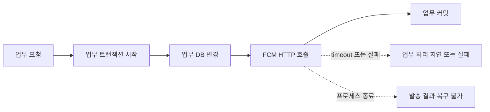
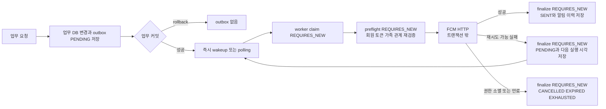

# LLD-0036: FCM 영속 발송과 고정 수신자

| 항목 | 값 |
| --- | --- |
| 상태 | Approved (재시도·불명 이력 정책 사용자 승인, 운영 검증 별도) |
| Issue | #608 (상위 #604) |
| 관련 ADR | [ADR-0028](../adr/ADR-0028-fcm-durable-delivery.md) |
| 작성자 | Codex |
| 작성일 | 2026-09-14 |

## 1. 목적 / 배경

FCM 장애와 프로세스 재시작 때 발송 요청이 사라지지 않도록 업무 데이터와 outbox를 함께 저장한다. 실제 HTTP는 DB 트랜잭션 밖에서 수행하고, 재시도 직전 수신자 자격을 다시 확인해 정지·가족 해제·계정 전환 뒤 잘못된 발송을 막는다.

### 변경 전: 업무 트랜잭션 안의 동기 FCM 호출

### 변경 후: 영속 outbox와 트랜잭션 밖 발송

## 2. 범위

### In scope

- widyu-domain outbox 및 신규 알림 고정 수신자 FK, widyu-api enqueue/worker/HTTP 경계.
- 도메인 이벤트·앨범·응원·긴급 알림의 영속 접수, 커밋 후 즉시 최초 시도, 제한 재시도와 TTL.
- 관리자 테스트의 bounded 동기 HTTP 및 기존 성공 토큰 수 계약 유지.
- MySQL 수동 마이그레이션, ERD, 로컬 회귀·하네스 검증.

### Out of scope

- #603 Member 엔티티·MemberRepository 변경. 현재 ACTIVE 상태를 참조한다.
- 기존 알림 원수신자 추정·backfill·삭제. 불명 이력의 앱 숨김은 범위에 포함한다.
- 운영 FCM·PG·AWS 호출, push/PR/배포.

## 3. 인터페이스 / API

`POST /api/v1/fcm/send` 요청 DTO와 응답 래퍼를 유지한다. 성공 문구는 **알림 발송 요청을 접수했습니다**로 변경한다. 성공은 요청 처리 완료이며 단말 수신 또는 FCM HTTP 완료를 뜻하지 않는다. 수신 조건에 따라 실제 발송 대상이 없을 수 있다.

관리자 테스트는 상위 서비스 트랜잭션을 제거하고 NOT_SUPPORTED 동기 발송으로 HTTP 성공 토큰 수를 반환한다. `fcm.delivery.admin-timeout` 기본 30초를 발송 루프 예산으로 사용하며, 남은 시간이 HTTP 제한시간(기본 10초) 이상일 때만 다음 토큰을 시도한다. 토큰별 HTTP 직전에 회원 ACTIVE·토큰 활성·owner 일치를 재조회한다. 관리자 테스트의 기존 알림 설정 우회 계약은 유지한다. 이 예산은 전체 HTTP 요청의 DB 조회·감사로그 시간까지 제한한다는 뜻은 아니다.

기동 시 admin-timeout은 HTTP timeout보다 엄격하게 커야 한다. 두 값이 같거나 admin-timeout이 작으면 설정 오류로 거부한다.

## 4. 데이터 모델

`widyu-domain`의 `FcmOutbox`는 기기별 요청이다. 토큰 문자열을 복제하지 않고 발송 직전 고정 토큰 ID의 현재 활성·소유자를 검증한다.

| 컬럼 | 의미 |
| --- | --- |
| id | BIGINT identity PK |
| recipient_member_id | NOT NULL member FK, 변경하지 않는 수신자 |
| member_fcm_token_id | NOT NULL member_fcm_token FK |
| related_member_id, family_id | nullable BIGINT, 가족 관계 검증 대상 회원과 접수 당시 가족 |
| title, body, image, scheme | VARCHAR(255), 발송 내용 |
| fcm_category | VARCHAR(32) |
| emergency | NOT NULL BOOLEAN, HEART_MESSAGE와 독립된 긴급 여부 |
| state | PENDING / CLAIMED / SENT / CANCELLED / EXHAUSTED / EXPIRED |
| attempts, fence | INT 시도 횟수, BIGINT 소유권 세대 |
| available_at, expires_at, lease_until | DATETIME(6), 다음 실행·만료·claim 종료 시각 |
| created_at, updated_at | DATETIME(6) |

조회 인덱스는 `(state, available_at, lease_until)`이다. `FcmNotification.recipient_member_id`는 nullable member FK로 추가한다. 신규 이력은 반드시 실제 고정 수신자를 기록한다. legacy null은 DB에 보관하되 앱 목록·카테고리 목록·미읽음 개수·개별/전체 읽음 처리에서 제외한다. 현재 토큰 소유자로 수신자를 추정하지 않는다.

## 5. 처리 흐름

1. 도메인 이벤트를 업무 트랜잭션 안에서 처리한다. 고정 수신자·토큰·관련 가족을 결정하고 REQUIRED enqueue로 outbox를 저장한다. 앨범 AFTER_COMMIT에서 enqueue하지 않는다. 심박 긴급 이벤트 발행은 `HeartRatePersistenceService.saveMeasurement` 트랜잭션으로 옮겨 긴급 기록과 outbox를 함께 커밋한다.
2. 커밋 후 bounded executor가 최초 발송 시도를 즉시 시작한다. rollback은 요청과 callback을 남기지 않는다. 실행기 거절·프로세스 종료는 polling으로 회수한다.
3. worker는 기본 1초 간격, 최대 50건을 조회해 bounded executor(2개 worker, 대기 100개)에 제출한다. 실제 작업을 시작할 때 한 건씩 REQUIRES_NEW 트랜잭션에서 행 비관적 잠금을 얻고 due/만료/lease/최대 시도와 수신 자격을 확인한다. 다른 worker가 유효 lease를 소유하면 건너뛴다.
4. 수신자와 관련 회원 ACTIVE, 토큰 active·owner 일치, 알림 설정, 고정 가족과 현재 관계를 재검증한다. 조건이 사라지면 CANCELLED, TTL 경과면 EXPIRED, 허용 시도 소진이면 EXHAUSTED로 종료한다.
5. attempts/fence를 증가시키고 CLAIMED 및 lease를 저장한 뒤 트랜잭션을 끝낸다. 인증 credential refresh는 트랜잭션 밖에서 실행한다. 인증 후 실제 HTTP 직전에 별도 REQUIRES_NEW preflight가 fence·lease·만료·수신 자격·토큰 문자열을 다시 확인한다. preflight 트랜잭션을 끝낸 다음 HTTP를 전송한다.
6. 별도 REQUIRES_NEW finalize가 행을 잠그고 fence·상태·lease를 비교한다. 이전 worker 결과는 무시한다. 성공은 SENT와 고정 수신자 알림 이력을 함께 저장한다. 재시도 가능 실패는 다음 실행 시각을 영속화한다. 영구 무효 토큰 비활성화는 토큰 ID·고정 owner·발송 토큰 문자열을 WHERE 조건으로 둔 bulk UPDATE를 사용해 동시 계정 전환의 owner를 덮어쓰지 않는다.

### 호출자 트랜잭션 경계 (후속 검수 수정)

`sendMessageToUser`의 REQUIRED는 외부 readOnly를 쓰기 트랜잭션으로 승격하지 않는다. 걷기·건강 일정 스케줄러의 public 진입점을 writable로 수정한다. private helper의 self-invocation에는 새 트랜잭션을 기대하지 않으며, 스케줄 실행의 조회와 outbox 저장은 같은 트랜잭션에 둔다. 커밋 실패 시 전체 outbox와 wakeup을 취소한다. enqueue를 일괄 REQUIRES_NEW로 바꾸지 않는다.

production 직접 호출 10곳과 그 외부 경계를 조사했다.

| 호출 경로 | 실제 경계 |
| --- | --- |
| 걷기 / 건강 일정 스케줄러 | public writable → private helper → FcmService / outbox REQUIRED |
| FcmService.sendNotificationToMember | public writable → self sendMessageToUser → 별도 outbox REQUIRED |
| HeartMessageService | writable 업무 트랜잭션 → FcmService REQUIRED |
| 심박 긴급 | HeartRatePersistenceService의 writable 저장·동기 이벤트 → listener REQUIRED |
| 앨범 생성·댓글·좋아요·해금 | writable 업무 이벤트 → 동기 listener REQUIRED |
| 앨범 영상 | 별도 빈의 @Async @Transactional → 동기 listener REQUIRED |
| 앨범 조회 | 외부 getAlbumDetail readOnly → 기존 AlbumViewService.recordView REQUIRES_NEW writable에서 조회 기록·outbox 함께 저장 |
| 앨범 비활성 스케줄러 | public writable → FcmService REQUIRED |
| 복약 스케줄러의 시니어/보호자 호출 | 외부 tx 없음 → FcmService 프록시가 수신자별 writable 시작 |
| 안전구역 | updateAndBroadcast writable → private 계산 helper → 동기 이벤트 → listener REQUIRED |

enqueue하는 AFTER_COMMIT listener는 없다. AFTER_COMMIT은 이미 저장한 요청의 worker wakeup만 수행한다. 기존 앨범 조회의 REQUIRES_NEW는 조회 기록의 독립 업무 경계이며 이번에 추가한 우회가 아니다.

### 서버 재시도 기한과 플랫폼 보관 기한

서버는 outbox의 원래 `expiresAt` 이후 새 HTTP를 시작하지 않는다. FCM이 수락한 뒤 오프라인 단말을 기다리는 보관 기한은 별도이므로 durable 요청에 플랫폼 만료 설정도 전달한다. `FcmDelivery`는 claim에서 outbox ID와 원래 만료 시각을 유지한다. 기존 DB의 LocalDateTime은 생성에 사용하는 서버 기본 시간대로 Instant로 변환한다. 모든 worker는 같은 시간대·동기화된 시계를 사용해야 한다.

OAuth 자격증명 갱신과 DB preflight가 끝난 뒤 잔여 시간을 계산한다. Android `message.android.ttl`은 잔여 초를 내림하고 FCM 한도인 28일로 제한한 `Ns` 문자열이다. 양수지만 1초 미만이면 `0s`로 보관 없이 즉시 전달만 요청한다. APNs `message.apns.headers.apns-expiration`은 원래 만료 시각을 Unix epoch 초로 내림한 문자열이다. 만료했으면 HTTP를 시작하지 않으며 직렬화 후에도 다시 검사한다. 관리자 직접 테스트는 outbox가 없으므로 이 메타데이터를 생성하지 않는다.

`message.data.notificationId`는 outbox ID 문자열이다. 재시도 시 fence가 바뀌어도 이 ID와 절대 만료 시각은 유지된다. 기기별 outbox ID이므로 기기 간 공통 이벤트 ID 또는 FcmNotification 이력 ID로 해석하지 않는다. 앱이 이를 사용해 중복을 제거할 수 있지만 기존 앱 dedup은 아직 구현되지 않았다.

플랫폼 보관 제한은 단말 도착·화면 표시 시각 보장이 아니다. Android TTL은 제공자 수락 시점부터의 상대 기간이라 HTTP 전송 지연도 경쟁 구간에 포함된다. 최종 검사 이후 이미 송신 중인 요청은 회수할 수 없으며, 서버가 timeout을 반환해도 FCM이 이미 수락했을 수 있다. 클라이언트 만료 검사·dedup 및 단말 실측은 이번 서버 변경의 보장 범위에 포함하지 않는다. 형식과 의미는 [FCM REST API](https://firebase.google.com/docs/reference/fcm/rest/v1/projects.messages)와 [메시지 수명 문서](https://firebase.google.com/docs/cloud-messaging/customize-messages/setting-message-lifespan)를 따른다.

기존 `fcm.send` timer 이름을 유지하되 측정 단위는 claim을 획득한 기기별 durable dispatch(HTTP/preflight/finalize)로 바뀐다. 큐 대기시간과 claim 이전 시간, 단말 전달시간은 이 timer에 포함되지 않는다.

기술 설정 기본값은 lease 60초, poll-delay-ms 1000, batch 50이다. `firebase.http.total-timeout` 기본값은 10초이며 인증을 포함한 호출 전체 대기시간을 제한한다. lease는 HTTP 제한시간에 5초를 더한 값보다 커야 한다. 정책 설정 `fcm.delivery.max-retries`(Integer), `normal-ttl`·`emergency-ttl`(Duration)은 운영 YAML/Compose에서 승인된 기본값 5·86400s·300s를 제공한다. 허용 HTTP 시도는 최초 1회 + max-retries이며 재시도 도중 기한이 지나면 남은 횟수와 관계없이 종료한다. 비활성 기본 플래그로 기존 알림을 끄지 않는다.

배포 환경에서 `FCM_DELIVERY_MAX_RETRIES`, `FCM_DELIVERY_NORMAL_TTL`, `FCM_DELIVERY_EMERGENCY_TTL`로 주입한다. 환경변수를 지정하지 않으면 사용자 승인 기본값 5·86400s·300s를 적용한다. 기존 운영 환경변수는 기본값보다 우선하므로 배포 전 실제 값이 승인 정책과 일치하는지 확인한다. 횟수는 음수가 아닌 정수, TTL은 양의 Duration이어야 한다.

## 6. 예외 / 에러 처리

| 상황 | 처리 |
| --- | --- |
| 429, 일시적인 서버 오류, timeout | 실패 상태 및 다음 실행 시각을 저장하고 제한 내 재시도 |
| 영구 무효 토큰 | 고정 토큰의 현재 소유자를 확인한 뒤 비활성 처리, 종료 |
| 정지, 토큰 비활성·소유자 변경, 설정 OFF, 가족 해제 | HTTP 없이 CANCELLED |
| TTL 경과 / 시도 소진 | EXPIRED / EXHAUSTED |
| credential refresh 도중 만료·자격 변경 | HTTP 직전 preflight에서 만료는 EXPIRED, 자격 변경은 CANCELLED; lease·fence 상실은 결과 미반영 |
| lease 중복 claim / 오래된 finalize | 발송 소유권 획득 실패 / 결과 미반영 |
| 커밋 후 최초 실행기 거절 | 업무 응답은 유지하고 polling으로 회수 |

FCM HTTP 성공 직후 DB 반영 전에 종료되면 중복 발송이 가능하다. fence는 오래된 DB 변경을 막지만 이미 수행한 HTTP를 되돌릴 수 없다.

preflight가 끝난 직후 실제 HTTP를 시작하기 전 회원·토큰·가족 상태가 바뀌는 경쟁 구간은 남는다. 외부 호출 동안 DB 잠금을 유지하지 않으므로 이 구간까지 원자적으로 막는다고 보장하지 않는다.

## 7. 인수조건 (Acceptance Criteria)

- [x] AC1: 업무 커밋 후 최초 HTTP를 시도하고 rollback이면 발송·outbox가 남지 않는다.
- [x] AC2: HTTP 중 활성 DB 트랜잭션이 없고 인증·HTTP timeout이 제한된다.
- [x] AC3: 동시 claim은 한 worker만 획득하고 lease 회수 후 이전 fence finalize는 무효다.
- [x] AC4: 429/timeout을 영속 재시도하고 횟수·일반/긴급 TTL에 따라 종료한다.
- [x] AC5: 영구 무효 토큰은 재시도하지 않고 해당 소유자 토큰만 비활성화한다.
- [x] AC6: 가족 해제·회원 정지·토큰 소유자 변경·설정 OFF 뒤 HTTP를 보내지 않는다.
- [x] AC7: 신규 이력은 고정 수신자 조회·읽음 권한을 사용하고 legacy 데이터는 변경하지 않는다.
- [x] AC8: 앨범은 업무 트랜잭션에서 enqueue하며 긴급 여부는 카테고리와 분리된다.
- [x] AC9: 관리자 테스트 성공 토큰 수 계약과 응원 접수 문구/Swagger가 반영된다.
- [x] AC10: 필수 정책 설정 누락을 감지하고 운영 기본 정책값을 임의 지정하지 않는다.
- [x] AC11: compileJava, 관련 회귀, harness verify 및 review 결과를 기록한다.
- [x] AC12: 실제 걷기·건강 일정 스케줄러 프록시가 writable tx에서 outbox를 커밋하고, 커밋 직전 실패로 rollback하면 outbox·최초 송신·polling 송신이 없다.
- [x] AC13: loopback에서 OAuth/preflight 대기를 차감한 Android TTL, APNs 절대 만료, 재시도 notificationId 유지 및 만료 시 HTTP 0건을 확인한다.
- [x] AC14: 승인된 재시도·TTL 기본값을 prod YAML/Compose에서 제공하고, 운영 YAML 로드와 Compose 기본값을 회귀로 확인한다.
- [x] AC15: 수신자 불명 legacy 행은 토큰 계정 전환 뒤에도 앱 목록·개수·개별/전체 읽음 경로에서 숨기고 DB 원본은 보존한다.

최종 `bash scripts/harness/verify.sh`는 exit 0으로 통과했다. Gradle 전체 테스트 실행은 29초이며 Domain 28건 통과, API 574건 중 571건 통과·3건 skipped·실패/오류 0건이다. 합계 599건 통과·3건 skipped다. skipped 3건은 `test_300mb.mp4`가 없는 `VideoCompressionBenchmarkTest` 로컬 벤치마크다. outbox 통합 테스트 13건은 XML 기준 0.213초에 통과했고 HTTP 14케이스는 loopback으로 검증했다. compileJava와 정적 검사도 통과했다. 이 수치는 로컬 회귀 실행시간이며 운영 성능 실측이 아니다.

리뷰의 REQUEST_CHANGES 지적을 수정하고 자체 검수 APPROVE를 받았다. 이 승인과 AC 체크는 로컬 구현·검증 범위에 한하며 운영 정책값이나 배포를 승인한 것이 아니다.

위 수치와 APPROVE는 ebbb6dc 시점 기록이다. 이후 부모 독립 검수에서 두 실제 스케줄러의 readOnly 호출자 결함을 발견해 **REQUEST_CHANGES로 정정했다**. 이전 검수는 실제 호출자 경계를 빠뜨렸으며 AC1을 충분히 검증하지 못한 실패로 보존한다. 후속 회귀는 테스트 자체의 외부 tx 없이 실제 scheduler 프록시를 호출하고, 실제 FcmService·enqueue·H2를 사용한다. H2가 readOnly 쓰기를 허용해도 놓치지 않도록 실제 tx의 readOnly=false도 검사한다. 커밋 직전 예외를 주입해 outbox insert 이후 rollback 및 송신 부재를 확인한다. 후속 집중 회귀는 통과했으며 최종 harness·독립 재검수 결과는 아래에 누적한다.

후속 최종 `bash scripts/harness/verify.sh`는 exit 0이다. 변경 범위 정적 검사와 compileJava(2초), API 전체 테스트(35초)가 통과했다. XML 기준 113개 suite, 582건 중 579건 통과·3건 skipped·실패/오류 0건이다. skipped는 기존 영상 파일 부재 벤치마크 3건이다. HTTP loopback 16건(1.156초), 실제 scheduler 통합 4건(0.127초), outbox 통합 13건(0.573초)이 포함된다. 후속 변경은 API에 한정되므로 Domain 테스트를 다시 실행하지 않았다. 운영 FCM·PG·AWS·MySQL 호출과 단말 전달 실측은 미실행이다.

후속 독립 재검수는 코드·신규 테스트·문서·XML을 확인하고 발견 결함 0건으로 **APPROVE**했다. 자체 review도 AC1~13, 호출자의 업무 원자성, DTO/모듈 규칙, 실패 후 상태와 한계를 대조해 APPROVE했다. 이번 판정은 이전 누락을 없애지 않으며, 현재 후속 수정의 로컬 커밋 근거다. 운영 정책·배포 승인은 포함하지 않는다.

2026-09-14 후속 정책 보완에서 `FcmDeliveryPropertiesTest` 5건과 `FcmOutboxIntegrationTest` 13건을 재실행해 prod YAML의 승인 기본값·환경변수 재정의와 legacy 행의 목록·개수·개별/전체 읽음 차단을 확인했다. 변경 범위 harness와 Docker Compose 회귀도 exit 0으로 통과했다. 실제 운영 MySQL 마이그레이션·FCM 단말 전달·기존 운영 환경변수 값 확인은 미실행이다.

## 8. 영향 범위 / 마이그레이션

배포 전 [create_fcm_outbox.sql](../../scripts/mysql/create_fcm_outbox.sql)을 운영과 동등한 MySQL에 적용하고, `fcm_notification.recipient_member_id`·`fcm_outbox`·인덱스가 생성됐는지 확인한다. 신규 테이블 및 nullable 이력 FK만 추가하고 기존 이력 UPDATE/DELETE는 수행하지 않는다. null legacy는 앱에서 숨기며 원수신자를 현재 토큰 소유자로 backfill하지 않는다. 이 SQL은 자동 실행 마이그레이션이 아니며 운영 실행·MySQL 실측은 미실행이다.

운영 prod profile은 환경변수 미지정 시 승인 기본값을 사용한다. 기존 `FCM_DELIVERY_*` 환경변수는 기본값보다 우선하므로 배포 전 승인값과 일치하는지 확인한다.

## 9. 미결정 사항(Open Questions)

- [x] 2026-09-14 사용자 승인: 추가 재시도 5회, 일반 24시간·긴급 5분. 실제 운영 환경변수 값 확인은 배포 전 수행한다.
- [x] 2026-09-14 사용자 승인: 원수신자 불명 기존 이력은 DB에 보관하고 앱에서 숨긴다. owner backfill·삭제는 하지 않는다.
- [ ] 운영 HTTP/인증/DB 환경의 지연과 lease 여유 검증. 로컬 mock·loopback 결과가 운영 전달 보장을 의미하지 않는다.

## 10. 참고

- [LLD-0002](LLD-0002-fcm-notification.md), [LLD-0014](LLD-0014-fcm-token-ownership-transfer.md)
- [ERD](../erd/ERD-0001-initial-domain.md)
- 로컬 apiDocs: 기존 FCM 문서가 없어 `apiDocs/FCM-608-durable-delivery.md`를 새로 작성했다. Git 제외 파일이며 강제 추가하지 않는다.
